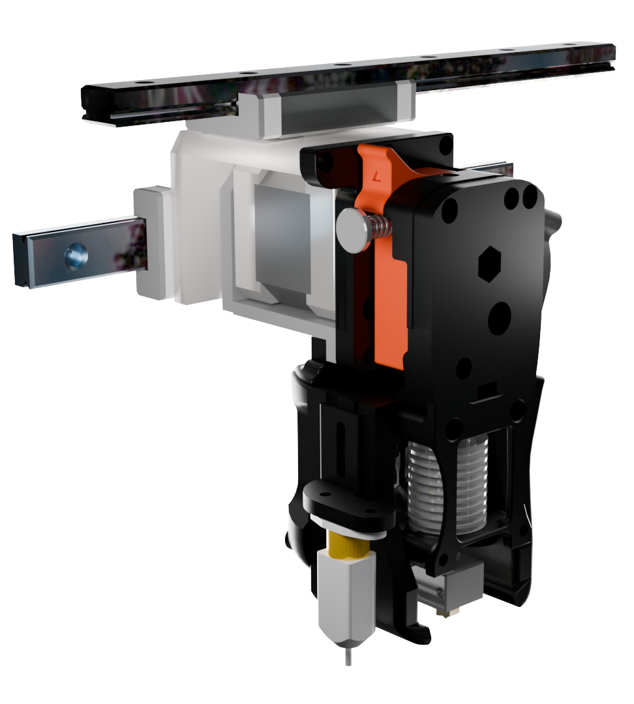

# Replicator-Klipperfication

## Abstract

The intent of this project was to revive a MakerBot Replicator+ by replacing its proprietary control system with modern, open-source electronics. The original printer, while capable in its time, had been put out of service in part due to its discontinued parts and incompatibility with modern slicers. By installing a BTT Pi, SKR Mini E3, and open-source Klipper software, the printer was brought up to current standards while retaining its original mechanical frame and gantry system. Every part of the machine, with the exception of the frame and gantry, can now be sourced from online retailers or 3d printed. Throughout the build, several unexpected issues arose, including failures in the Pi's stock 24 V buck converter and incompatibility with the first purchased touchscreen, but these were resolved with alternative hardware. The result is a fully functional, easily maintainable printer that offers improved print quality, faster workflow, and long-term serviceability using only open-source tools and components.

  
  

More information can be found in the [full report](report.pdf).

## Bill Of Materials

| Component                | Part                                   | Price | Notes                | Link |
|--------------------------|-----------------------------------------|-------|----------------------|------|
| Control Board            | BTT Pi V1.2                             | 32    |  Stock 24v Buck converter may fail   | https://a.co/d/30Qcsj7|
| Motor Controller         | SKR Mini E3 V3                          | 44    |  bought in combo with BTT Pi  | https://a.co/d/30Qcsj7 |
| Extruder                 | BMG Extruder                            | 6.53  |                      | https://www.aliexpress.us/item/3256805805447850.html |
| Heating Core             | Triangle Lab CHC Pro                    | 5.53  |                      | https://www.aliexpress.us/item/3256804038017822.html |
| Heatsink + Heatbreak     | V6 Heatsink                             | 7.58  |                      | https://www.aliexpress.us/item/3256802721411891.html |
| Nozzle                   | Came with Heatsink                      |       |                      |      |
| Screen                   | MPI3501                                 | 10.25 |                      | https://www.aliexpress.us/item/3256804172295020.html |
| Touch Panel              | 3.7\" Resistive Touch Panel            | 6.68  |                      | https://www.aliexpress.us/item/3256806894168830.html |
| BLTouch                  | 3DTouch                                 | 10.87 | This is a decent BLTouch clone  | https://www.aliexpress.us/item/3256802648193836.html |
| Wires                    | Stepper Motor Wires                      | varies   |  any standard stepper wires can be used   | https://a.co/d/eqlczG9 |
| Power Supply             | Creality 24V Power Supply               | 30    | can be obtained from an Ender 3    |https://a.co/d/9iuD99J|
| Input Shaping Sensor     | ADXL345                                 | 16    |                      | https://a.co/d/dzSP3lk |
| Heated Bed               | Ender 3 Heated Bed                      | 24    |                      | https://a.co/d/fFlMreV |
| HDMI Adapter             | Micro HDMI to HDMI Adapter              | 3.49  |                      | https://www.aliexpress.us/item/3256803000529672.html |
| 5V Buck Converter        | 24 → 5V Buck Converter                  | 7.49  | Overkill and only needed if onboard one fails | https://www.aliexpress.us/item/2255799834871688.html |
| Touch Screen Adapter     | AR1100 Resistive Touch → USB Controller | 9.95  |                      | https://www.amazon.com/Noctua-NF-A4x10-24V-PWM-Applications/dp/B0CN39MCPL |
