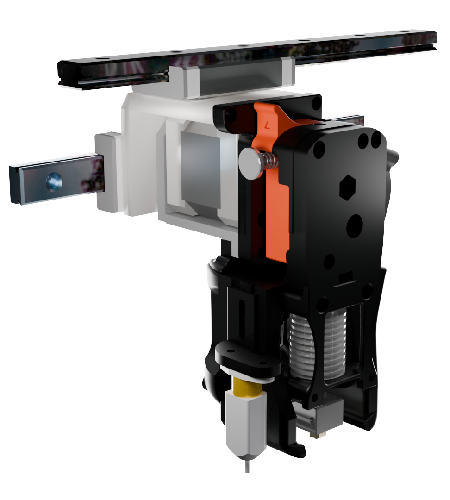
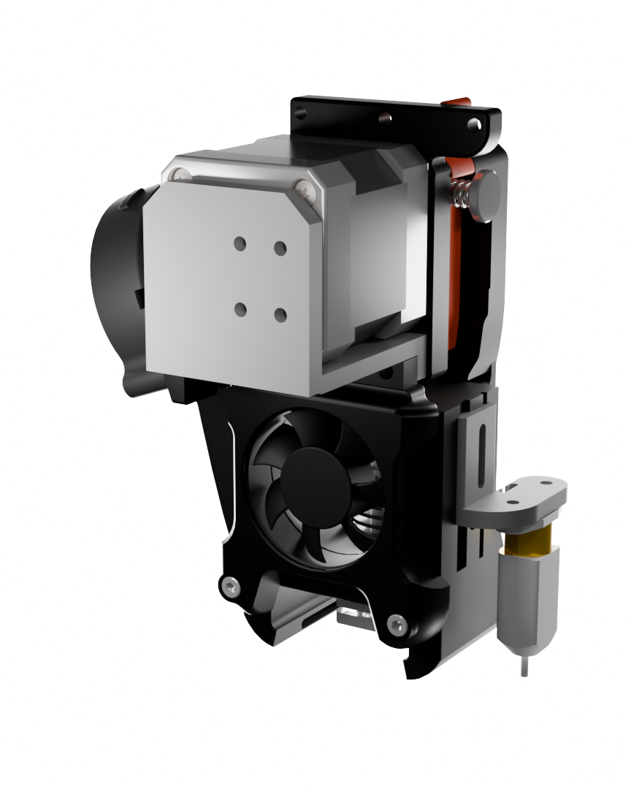

# Replicator-Klipperfication

## Abstract

The intent of this project was to revive a MakerBot Replicator+ by replacing its proprietary control system with modern, open-source electronics. The original printer, while capable in its time, had been put out of service in part due to its discontinued parts and incompatibility with modern slicers. By installing a BTT Pi, SKR Mini E3, and open-source Klipper software, the printer was brought up to current standards while retaining its original mechanical frame and gantry system. Every part of the machine, with the exception of the frame and gantry, can now be sourced from online retailers or 3d printed. Throughout the build, several unexpected issues arose, including failures in the Pi's stock 24 V buck converter and incompatibility with the first purchased touchscreen, but these were resolved with alternative hardware. The result is a fully functional, easily maintainable printer that offers improved print quality, faster workflow, and long-term serviceability using only open-source tools and components.

  
  

More information can be found in the [full report](report.pdf).

## Bill Of Materials

| Component                | Part                                   | Price | Notes                | Link |
|--------------------------|-----------------------------------------|-------|----------------------|------|
| Control Board            | BTT Pi V1.2                             | 32    |  Stock 24v Buck converter may fail   | https://a.co/d/30Qcsj7|
| Motor Controller         | SKR Mini E3 V3                          | 44    |  bought in combo with BTT Pi  | https://a.co/d/30Qcsj7 |
| Extruder                 | BMG Extruder                            | 6.53  |                      | https://www.aliexpress.us/item/3256805805447850.html |
| Heating Core             | Triangle Lab CHC Pro                    | 5.53  |                      | https://www.aliexpress.us/item/3256804038017822.html |
| Heatsink + Heatbreak     | V6 Heatsink                             | 7.58  |                      | https://www.aliexpress.us/item/3256802721411891.html |
| Nozzle                   | Came with Heatsink                      |       |                      |      |
| Screen                   | MPI3501                                 | 10.25 |                      | https://www.aliexpress.us/item/3256804172295020.html |
| Touch Panel              | 3.7\" Resistive Touch Panel            | 6.68  |                      | https://www.aliexpress.us/item/3256806894168830.html |
| BLTouch                  | 3DTouch                                 | 10.87 | This is a decent BLTouch clone  | https://www.aliexpress.us/item/3256802648193836.html |
| Wires                    | Stepper Motor Wires                      | varies   |  any standard stepper wires can be used   | https://a.co/d/eqlczG9 |
| Power Supply             | Creality 24V Power Supply               | 30    | can be obtained from an Ender 3    |https://a.co/d/9iuD99J|
| Input Shaping Sensor     | ADXL345                                 | 16    |                      | https://a.co/d/dzSP3lk |
| Heated Bed               | Ender 3 Heated Bed                      | 24    |                      | https://a.co/d/fFlMreV |
| HDMI Adapter             | Micro HDMI to HDMI Adapter              | 3.49  |                      | https://www.aliexpress.us/item/3256803000529672.html |
| 5V Buck Converter        | 24 → 5V Buck Converter                  | 7.49  | Overkill and only needed if onboard one fails | https://www.aliexpress.us/item/2255799834871688.html |
| Touch Screen Adapter     | AR1100 Resistive Touch → USB Controller | 9.95  |                      | https://www.amazon.com/Noctua-NF-A4x10-24V-PWM-Applications/dp/B0CN39MCPL |

## Ideas for the Future
New Nozzle - I think the current nozzle is the main source of bad prints currently. 
Cable Management - The way the cables currently hang could very well get in the way of a print. They are also an eyesore. The wires in the back panel also need some work. Not all wires have the correct connector so they are hotglued to the controller. This has caused problems with motors vibrating loose over time.
USB hub in the UI console - Adding this would reduce the amount of wires going to the screen from 4 down to 1. The BTT-Pi can output video over USB-C so not only would the usb cables be reduced to one but the HDMI cable could be removed as well.
Input Shaping - I bought an input shaper but ran out of time to set it up fully. This would improve print quality without much effort and some of my efforts can be found in the input_shaper.cfg file.
PEI Bed - This was a result of cost, but magnetic PEI beds are not absurdly expensive for the size bed on this printer and would immediately improve the ease-of-use of the printer compared to the glass bed on there now.
Reprint Printhead in Black and Red - not a necessary upgrade but it would be nice if the actual product matched the renders.
Foodsafe Upgrade - it would be cool to turn this into a printer designated to printing food-safe filament. Really the only components that would need to be changed are the nozzle and heatbreak which need to be upgraded anyway.
Fine-Tune Slicer Settings - This is another thing that just takes time that I did not have. It just takes a lot of measuring and test prints.